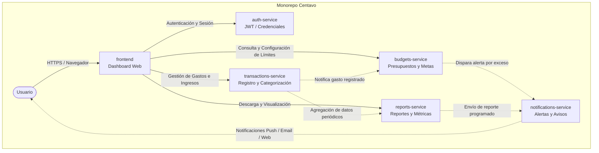

# Centavo 🪙

**Centavo** es una aplicación de finanzas personales diseñada para uso individual, orientada a brindar control total sobre la economía personal mediante el registro ágil de gastos, la gestión inteligente de presupuestos y la emisión proactiva de alertas ante sobregastos.

---

## 🚀 Características Principales

- **Registro y categorización de transacciones:** Captura de ingresos y gastos con categorización automática o personalizada.
- **Gestión de presupuestos:** Definición de techos de gasto por categoría y períodos (mensual, semanal, etc.).
- **Alertas de sobregasto:** Detección en tiempo real cuando un gasto compromete o supera el presupuesto asignado.
- **Reportes automáticos:** Generación periódica de resúmenes financieros, análisis de tendencias y balance de hábitos de consumo.
- **Seguridad y autenticación:** Acceso protegido y aislamiento de la información del usuario.

---

## 🏛️ Diagrama de Arquitectura

El sistema está concebido como una arquitectura de microservicios dentro de un monorepo, donde cada servicio opera con independencia de dominio y responsabilidades claras:



---

## 📁 Estructura del Proyecto (Monorepo)

```text
CENTAVO_PLATZI/
├── frontend/                 # Interfaz de usuario (Dashboard web / SPA)
├── auth-service/             # Servicio de autenticación y gestión de usuarios
├── transactions-service/     # Gestión y categorización de ingresos y gastos
├── budgets-service/          # Definición y seguimiento de presupuestos
├── notifications-service/    # Sistema de alertas (push, correos, avisos)
├── reports-service/          # Generación de reportes financieros automáticos
└── README.md                 # Documentación general de la solución
```

---

## 🧩 Propósito de Cada Componente

### 1. `frontend` (Dashboard)
- **Propósito:** Proporcionar una interfaz gráfica limpia, responsiva e intuitiva.
- **Responsabilidades:**
  - Panel principal con resumen de saldo, gráficas de distribución de gastos e indicadores de salud financiera.
  - Vistas dedicadas para registrar transacciones, crear presupuestos y visualizar el historial de alertas.
  - Consumo de APIs de los diferentes microservicios mediante comunicación HTTP/REST.

### 2. `auth-service`
- **Propósito:** Centralizar el control de acceso, registro e inicio de sesión del usuario.
- **Responsabilidades:**
  - Registro, inicio de sesión y validación de credenciales.
  - Emisión y verificación de tokens de sesión (JWT) para autorizar peticiones hacia los demás servicios.
  - Resguardo seguro de credenciales con hashing (e.g. bcrypt/argon2).

### 3. `transactions-service`
- **Propósito:** Administrar el ciclo de vida de los movimientos financieros (gastos e ingresos).
- **Responsabilidades:**
  - Crear, listar, editar y eliminar transacciones.
  - Asignar categorías y etiquetas a cada movimiento para su correcta clasificación.
  - Proveer endpoints de consulta de transacciones filtradas por rango de fechas o categoría.

### 4. `budgets-service`
- **Propósito:** Monitorear y hacer cumplir los límites de gasto establecidos por el usuario.
- **Responsabilidades:**
  - Creación de presupuestos periódicos por categoría (por ejemplo: Alimentación, Transporte, Ocio).
  - Cálculo en tiempo real del porcentaje de presupuesto consumido al cotejar los gastos.
  - Evaluación de umbrales críticos (por ejemplo: 80% consumido, 100% alcanzado o sobregasto).

### 5. `notifications-service`
- **Propósito:** Gestionar y despachar alertas oportunas ante eventos relevantes en la app.
- **Responsabilidades:**
  - Envío de notificaciones inmediatas al detectar sobregiros o proximidad al límite de presupuesto.
  - Despacho de avisos sobre reportes semanales/mensuales disponibles.
  - Soporte multicanal (notificaciones en la app, push o correo electrónico).

### 6. `reports-service`
- **Propósito:** Consolidar métricas y generar análisis periódicos sobre el comportamiento financiero.
- **Responsabilidades:**
  - Cálculo de balances mensuales, comparativas históricas y promedios diarios de gasto.
  - Generación de resúmenes periódicos exportables (PDF, Excel o JSON estructurado).
  - Identificación de patrones de gasto atípicos o categorías con mayor desviación.
